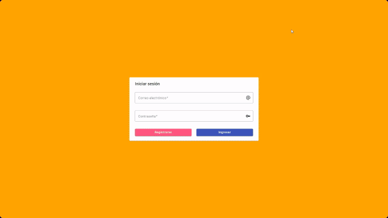

# Administrador de Cursos y Alumnos

Este proyecto es una aplicación de gestión de cursos y alumnos desarrollada en Angular. Utiliza JSON Server para simular un backend RESTful, lo que permite realizar operaciones CRUD sobre una base de datos ficticia.

## Descripción

La aplicación permite gestionar cursos y alumnos, proporcionando funcionalidades para crear, leer, actualizar y eliminar registros.

## Tecnologías Utilizadas

- Angular
- TypeScript
- Boostrap
- HTML/CSS
- JSON Server
- Angular Material

## Ejecucion del Proyecto

1. **Instala Dependencias**:
   Ejecuta 'npm install'

2. **Ejecuta el Servidor de JSON**:
   Ejecuta
   - 'json-server --watch database/db.json'

    en la terminal para cargar la Base de Datos para login y entidades.

   - USUARIO ADMINISTRADOR
   - correo: admin@mail.com
   - contraseña: 123456

   - USUARIO NORMAL
   - correo: user@mail.com
   - contraseña: 123456

## Creditos
Author: Solange Paniagua
